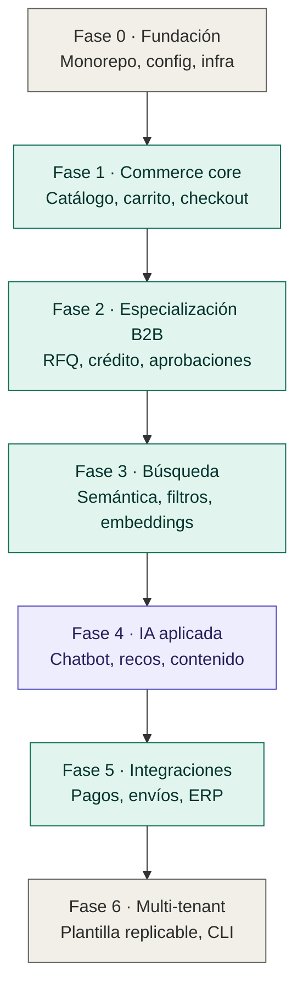
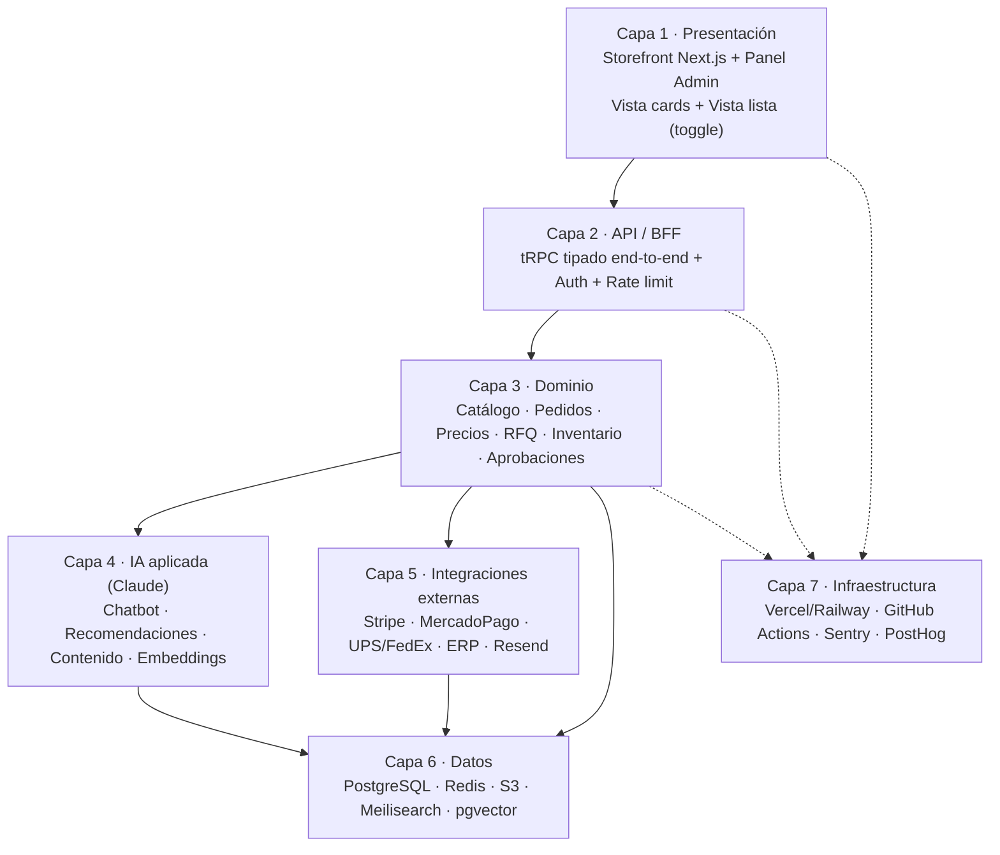

# Tienda Online B2B Mayorista con IA — Documento Maestro de Visión

> Documento vivo. Es el mapa de referencia del proyecto: roadmap, arquitectura, stack y decisiones clave.
> No reemplaza los specs por fase. Sirve para no perder el norte mientras avanzamos.

- Fecha de creación: 2026-05-25
- Owner: Herney
- Estado: Visión aprobada, arrancando Fase 0

---

## 1. Resumen ejecutivo

Construimos una **tienda online B2B mayorista** como **plantilla configurable multi-tenant**, pensada para operar en **USA + Latinoamérica con USD** como moneda base, y con **Claude integrado como parte del producto** (no sólo como herramienta de desarrollo).

El objetivo no es una tienda específica: es un **producto-plataforma** que permite lanzar nuevas tiendas mayoristas cambiando configuración, tema y catálogo, sin reescribir código.

### Principios rectores

1. **Headless y modular.** Frontend desacoplado del backend, cada módulo de dominio es independiente y testeable.
2. **Configuración sobre código.** Un solo archivo `store.config.ts` controla el comportamiento de una tienda concreta.
3. **TDD en módulos críticos.** Checkout, pagos, precios y órdenes se construyen con tests primero.
4. **IA como capa, no como hack.** La capa de IA tiene fronteras claras, abstracciones e interfaces.
5. **Observabilidad desde el día 1.** Logs estructurados, métricas y alertas antes de que haga falta debugger.
6. **Performance medible.** Core Web Vitals verdes en cada deploy. Búsqueda < 100ms p95.

---

## 2. Roadmap de 7 fases

Cada fase es un ciclo independiente: **brainstorming → spec → plan → implementación con TDD → review → merge**.

| Fase | Nombre | Entregables clave | Bloqueante para |
|------|--------|-------------------|-----------------|
| **0** | Fundación de la plantilla | Monorepo, `store.config.ts`, theme system, design system base, auth, DB, CI/CD, observabilidad mínima | Todas |
| **1** | Commerce core B2B (MVP) | Catálogo con variantes, organizaciones multi-usuario, listas de precios por cliente, carrito, checkout, órdenes, admin básico | 2, 3, 4, 5 |
| **2** | Especialización B2B | RFQ, Net 30 / crédito, catálogos privados, aprobaciones internas, descuentos por volumen, re-orden rápido | 5 (ERP) |
| **3** | Búsqueda y descubrimiento | Meilisearch + búsqueda semántica con embeddings, filtros facetados, productos relacionados, historial | 4 (recomendaciones) |
| **4** | Capa de IA aplicada | Generación de contenido + SEO + traducciones EN/ES, chatbot asistente de compra, recomendaciones personalizadas, admin AI, moderación de reviews | — |
| **5** | Integraciones externas | Stripe + pagos LATAM, transportistas, ERP/contabilidad, email transaccional, webhooks, analytics avanzada | — |
| **6** | Multi-tenant y replicación | CLI scaffolding, theme packages independientes, panel central de tiendas, despliegues múltiples | — |

### Diagrama del roadmap



---

## 3. Arquitectura por capas

La tienda se organiza en 7 capas, cada una con responsabilidad única y comunicación a través de interfaces explícitas.



### Detalle por capa

**Capa 1 — Presentación.** Next.js 14 con App Router, TypeScript, Tailwind, shadcn/ui. Dos vistas en el storefront: cards (default) y lista (alternativa para re-orden rápido). Panel admin como app separada en el monorepo. SSR/ISR para SEO y performance. Mobile-first.

**Capa 2 — API / BFF.** tRPC para tipado end-to-end entre cliente y servidor. NextAuth para autenticación. Rate limiting con Upstash. Validación con Zod. GraphQL público opcional para integraciones externas (Fase 5).

**Capa 3 — Dominio.** Servicios de negocio organizados por bounded context: `catalog`, `customers`, `pricing`, `cart`, `checkout`, `orders`, `quotes`, `inventory`, `approvals`. Cada servicio expone un API tipado y se puede testear de forma aislada.

**Capa 4 — IA.** Wrapper de Claude (Anthropic SDK) detrás de una interfaz `AIProvider` para poder cambiar de proveedor si hace falta. Cuatro sub-módulos: `content-generation`, `chat-assistant`, `recommendations`, `admin-helpers`. Embeddings en pgvector.

**Capa 5 — Integraciones.** Adapters detrás de interfaces: `PaymentAdapter`, `ShippingAdapter`, `EmailAdapter`, `ERPAdapter`. Permite cambiar Stripe por MercadoPago sin tocar dominio.

**Capa 6 — Datos.** PostgreSQL como source of truth (Prisma). Redis para caché y sesiones. S3 o Cloudinary para imágenes. Meilisearch para búsqueda full-text. pgvector dentro de Postgres para embeddings.

**Capa 7 — Infraestructura.** Turborepo como monorepo. GitHub Actions para CI/CD. Vercel o Railway para deploy. Sentry para errores, PostHog para producto, Datadog opcional para infra.

---

## 4. Stack tecnológico

| Categoría | Elección | Por qué |
|-----------|----------|---------|
| Lenguaje | TypeScript | Tipado end-to-end con tRPC + Zod |
| Frontend | Next.js 14 (App Router) | SSR/ISR, edge runtime, mejor SEO B2B |
| UI | Tailwind + shadcn/ui | Velocidad de desarrollo, accesibilidad, design system trivial de customizar |
| API | tRPC | Tipado sin generación de código |
| ORM | Prisma | Migraciones, tipado, productividad |
| DB | PostgreSQL 16 self-hosted (Coolify) | Confiable, soporta pgvector, sin cuota mensual |
| Caché / cola | Redis self-hosted (Coolify) | Sesiones, rate limit, jobs ligeros |
| Búsqueda | Meilisearch self-hosted | Open-source, rápido, instalable en el mismo VPS o aparte |
| Embeddings | pgvector | Cerca de la data relacional, sin Vector DB extra |
| Pagos | Stripe + adapters locales | Stripe global, MercadoPago/PSE/PIX para LATAM |
| Email | Resend | API simple, buena entregabilidad (no self-hosted email) |
| Imágenes | S3-compatible (Hetzner Storage Box o R2) + CDN | Transformaciones via next/image |
| Auth | NextAuth (Auth.js v5) | Magic links, SSO, multi-org listo |
| Repositorio | Single app Next.js (refactor a monorepo en Fase 6) | Velocidad de arranque sin perder modularidad si la disciplina de imports se mantiene |
| CI/CD | GitHub Actions + Coolify webhooks | Tests en CI, deploy en VPS |
| Hosting | Hetzner VPS + Coolify (Ashburn, USA East) | Autonomía total, costo predecible, Docker portable |
| Observabilidad | Sentry + PostHog + Uptime Kuma | Errores + producto + uptime |
| IA | Claude (Anthropic SDK) | Mejor calidad para texto comercial y razonamiento |

---

## 5. Dirección de UI

**Híbrida: vista cards (A) por defecto + vista lista (B) como toggle.**

- **Vista A — Catálogo profesional.** Cards limpias, imagen prominente, mucho aire. Ideal para descubrimiento, compradores nuevos, mobile, marketing.
- **Vista B — Lista densa.** Filas tipo tabla con qty inline y bulk add. Ideal para re-orden, compras grandes, compradores experimentados, CSV upload.

El toggle persiste por usuario y por organización. Misma data, dos UX. Inspiración: Shopify Plus B2B, Faire panel mayorista.

### Sistema de diseño

- Tokens centrales en `packages/design-tokens`: colores, espaciado, tipografía, radios.
- Componentes en `packages/ui` sobre shadcn/ui.
- Cada tienda puede sobreescribir tokens vía `theme.config.ts` sin tocar componentes.
- Accesibilidad WCAG 2.1 AA obligatoria (verificada en cada PR con `engineering:code-review` y `design:accessibility-review`).

---

## 6. Plantilla configurable

El núcleo del proyecto es la **configurabilidad**. Una nueva tienda se monta así:

1. `pnpm create @our-platform/store nueva-tienda`
2. Editar `store.config.ts` (marca, idiomas, monedas, pagos, módulos activos).
3. Editar `theme.config.ts` (colores, tipografía, logo).
4. Cargar catálogo (vía CSV, API o panel admin).
5. Deploy.

### Estructura del config

```ts
// store.config.ts
export default {
  identity: { name, logo, brand },
  locale: { defaultLocale: 'en-US', supported: ['en-US', 'es-419'] },
  currency: { base: 'USD', supported: ['USD'] },
  modules: {
    rfq: true,
    credit: true,
    privateCatalogs: true,
    multiUserApproval: true,
    aiChat: true,
  },
  payments: { stripe: true, mercadopago: false },
  shipping: { ups: true, fedex: true },
  ai: { contentGen: true, semanticSearch: true, recommendations: true }
}
```

---

## 7. Herramientas que usaremos

### Skills (Claude Code / Cowork)

| Skill | Cuándo se usa |
|-------|---------------|
| `superpowers:brainstorming` | Inicio de cada fase, para alinear el diseño |
| `superpowers:writing-plans` | Después del spec de cada fase, para el plan paso a paso |
| `superpowers:executing-plans` | Implementación de cada fase con checkpoints |
| `superpowers:test-driven-development` | Módulos críticos: checkout, precios, órdenes, pagos |
| `superpowers:systematic-debugging` | Cuando aparezcan bugs no triviales |
| `superpowers:using-git-worktrees` | Features en paralelo |
| `superpowers:requesting-code-review` | Antes de cada merge |
| `engineering:system-design` | Diseño de servicios de dominio |
| `engineering:architecture` | ADRs para decisiones grandes (ej: Meilisearch vs Algolia) |
| `engineering:code-review` | Review de PRs |
| `engineering:testing-strategy` | Planificación de cobertura por módulo |
| `engineering:debug` | Bugs específicos |
| `engineering:documentation` | READMEs, runbooks, API docs |
| `engineering:incident-response` | Cuando algo se rompa en producción |
| `frontend-design` | Storefront y admin con calidad de diseño real |
| `design:design-system` | Componentes, tokens, documentación |
| `design:accessibility-review` | A11y de cada pantalla nueva |
| `design:ux-copy` | Microcopy de checkout, errores, vacíos |
| `data:build-dashboard` | Dashboard de ventas en el admin |
| `data:write-query` | Queries analíticas |
| `docx` | Documentos comerciales (propuestas, contratos) |
| `pdf` | Facturas, packing slips, cotizaciones |
| `xlsx` | Importación/exportación de catálogo, reportes |
| `skill-creator` | Crear skills propios del proyecto (ver más abajo) |

### MCPs (a buscar en el registry y conectar)

- **GitHub** — gestionar PRs, issues, releases.
- **Stripe** — productos, suscripciones, pagos.
- **Postgres/Supabase** — queries y migraciones.
- **Sentry** — leer errores.
- **Vercel** — controlar deploys.
- **Linear o Asana** — gestión del proyecto.
- **Slack** — alertas.
- **Figma** — handoff de diseño (Fase 0).
- **Notion** — documentación.
- **PagerDuty** — oncall (Fase 5+).

### Plugins ya disponibles

- `engineering` — ciclo completo de desarrollo.
- `design` — diseño, accesibilidad, copy.
- `data` — analítica y dashboards.
- `superpowers` — workflow disciplinado de brainstorm → plan → TDD → review.
- `anthropic-skills` — docx, pdf, pptx, xlsx, frontend-design.

### Skills propios a crear (Fase 6 o antes si hacen falta)

Plugin `online-store-toolkit` con:

- `scaffold-nueva-tienda` — crear una tienda nueva desde la plantilla en minutos.
- `importar-catalogo` — pipeline CSV/Excel → DB con validación.
- `generar-descripciones-ia` — masivo, con tono configurable.
- `lanzar-campana` — descuento + landing + email + push.
- `auditar-checkout` — recorrido funcional + a11y + performance.

---

## 8. Cómo trabajaremos

1. **Una fase a la vez.** No saltamos hasta haber cerrado la actual.
2. **Cada fase tiene su spec en `docs/specs/`** y su plan en `docs/plans/`.
3. **TDD obligatorio** en checkout, pagos, precios, órdenes, descuentos.
4. **PR pequeños** (< 400 líneas idealmente).
5. **Review automatizado** con `engineering:code-review` antes de cada merge.
6. **CI verde** = condición sine qua non para merge.
7. **Documento maestro** (este archivo) se actualiza al cerrar cada fase.

---

## 9. Estado del proyecto

| Fase | Estado | Spec | Plan | Implementación |
|------|--------|------|------|----------------|
| 0 — Fundación | ✅ Cerrada (desplegada en prod) | [`docs/specs/2026-05-25-fase-0-fundacion.md`](docs/specs/2026-05-25-fase-0-fundacion.md) | [`docs/plans/2026-05-25-fase-0-fundacion-plan.md`](docs/plans/2026-05-25-fase-0-fundacion-plan.md) | App viva en sslip.io · Coolify + Postgres + pgvector en Hetzner |
| 1 — Commerce core | ✅ Cerrada (v1.0.0, 2026-05-26) | [`docs/specs/2026-05-26-fase-1-commerce-core.md`](docs/specs/2026-05-26-fase-1-commerce-core.md) | [`docs/plans/2026-05-26-fase-1-commerce-core-plan.md`](docs/plans/2026-05-26-fase-1-commerce-core-plan.md) | Catalog, pricing, cart, checkout, orders, impersonation desplegados |
| 2 — Especialización B2B | ✅ Cerrada (v2.0.0, 2026-05-26) | [`docs/specs/2026-05-26-fase-2-especializacion-b2b.md`](docs/specs/2026-05-26-fase-2-especializacion-b2b.md) | [`docs/plans/2026-05-26-fase-2-especializacion-b2b-plan.md`](docs/plans/2026-05-26-fase-2-especializacion-b2b-plan.md) | RFQ, crédito, aprobaciones, catálogos privados, descuentos por volumen, notifications |
| 3 — Búsqueda | ✅ Cerrada (v3.0.0, 2026-05-26) | [`docs/specs/2026-05-26-fase-3-busqueda-descubrimiento.md`](docs/specs/2026-05-26-fase-3-busqueda-descubrimiento.md) | [`docs/plans/2026-05-26-fase-3-busqueda-descubrimiento-plan.md`](docs/plans/2026-05-26-fase-3-busqueda-descubrimiento-plan.md) | Meilisearch + Voyage semántico + RRF + filtros facetados + homepage real + admin search panel |
| 4 — IA aplicada | Pendiente | — | — | — |
| 5 — Integraciones | Pendiente | — | — | — |
| 6 — Multi-tenant | Pendiente | — | — | — |

---

## 10. Próximo paso inmediato

Fase 3 cerrada (v3.0.0, 2026-05-26): 157 unit tests verdes, 6 e2e Fase 3 verdes, lint + typecheck + build limpios. Cambios mergeados a `main`, tag `v3.0.0` publicado. Ops manual pendiente: cuentas Meilisearch Cloud + Voyage AI, env vars en Coolify, scheduled tasks (worker 1min + cleanup semanal), init+bootstrap scripts en VPS.

Próximo: brainstorming de **Fase 4 — IA aplicada** en sesión Cowork (chatbot, recomendaciones, generación de contenido).

---

*Última actualización: 2026-05-26 cierre Fase 2 · Próxima revisión: arranque Fase 3*
